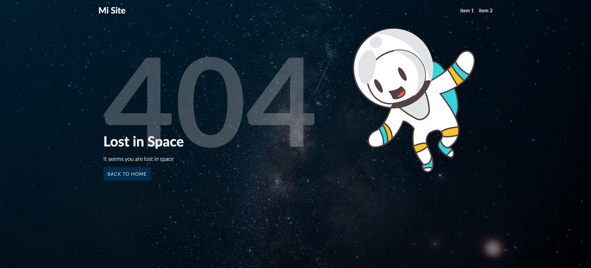

# challenge-html-03 404 HTML

Error 404 en HTML/CSS And Responsive design

[ver la aplicación](https://platzi-404.netlify.app/)

# Technologies
React
Stylus
Standard
Webpack

### RETO

1. Mejora el CSS del sitio [Peronalizalo a tu gusto]
2. Migrar este sitio en HTML/CSS a algún Framework/Libreria de JS (Angular, React, Vue, Svelte.)
3. Envia tu Pull Request.

### Enviar solución de reto
Debes hacer un "Fork" de este proyecto, revolver los problemas y crear un Pull Request hacia este repositorio.

### Contribuir
Si alguien quiere agregar o mejorar algo, lo invito a colaborar directamente en este repositorio: [challenge-html-03](https://github.com/platzimaster/challenge-html-03/)

### Licencia
challenge-html-03 se lanza bajo la licencia [MIT](https://opensource.org/licenses/MIT).
